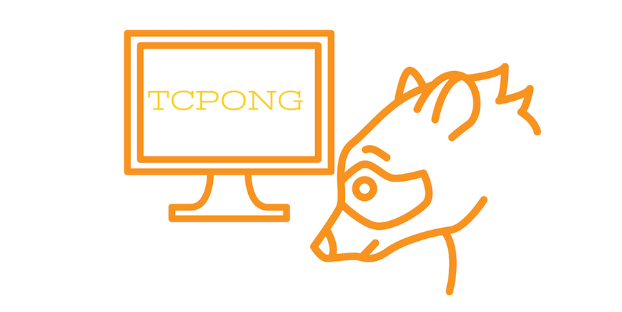

TCPONG
=================================
[](https://travis-ci.org/sakajunquality/tcpong)
[](https://codecov.io/gh/sakajunquality/tcpong)
[](https://goreportcard.com/report/github.com/sakajunquality/tcpong)
[](https://raw.githubusercontent.com/sakajunquality/tcpong/master/LICENSE)
[]()



Overview
------------
Ping over TCP


Installation
------------
```
$ go get github.com/sakajunquality/tcpong
```


Usage
------------
#### Normal output,
```
$ tcpong host port
```

## Future Perspectives
- Testing
- CI
- UDP supprt
- Additionl options

Contributing
-----
Always welcome for contributing


License & Authors
-----------------
- Author:: @sakajunquality
- License:: MIT
